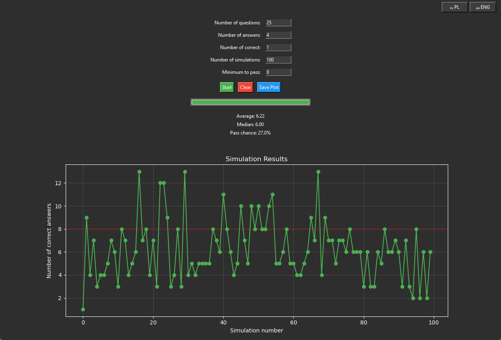

# Test Score Simulator

A Python application with a dark-themed GUI that simulates multiple-choice test attempts and calculates the probability of passing based on given parameters.

> Have you ever wondered what your chances are of passing a multiple-choice exam just by random guessing? Wonder no more! This elegant simulator lets you run thousands of test scenarios in seconds to discover your probability of success. Whether you're curious about exam statistics or just love data visualization, this tool turns random chance into beautiful insights.

## Features

- **Test Parameters Configuration:**
  - Number of questions
  - Number of possible answers per question
  - Number of correct answers per question
  - Minimum score required to pass
  - Number of simulations to run

- **Real-time Visualization:**
  - Live progress bar during simulation
  - Dynamic plot showing results of each simulation
  - Passing threshold line indicator
  - Statistical analysis (mean and median)
  - Pass probability calculation

- **User Interface:**
  - Clean, modern dark theme
  - Input validation
  - Plot saving functionality (PNG format)
  - Clear/Reset option

## Requirements

```python
python >= 3.7
tkinter
matplotlib
numpy
```

## Installation

1. Clone this repository:
```bash
git clone https://github.com/micbed86/test_sim.git
```

2. Install required packages:
```bash
pip install matplotlib numpy
```

## Usage

Run the application:
```bash
python sim.py
```

1. Enter the test parameters:
   - Set the number of questions
   - Define how many answers are available per question
   - Specify how many correct answers exist per question
   - Set the minimum score required to pass
   - Choose the number of simulations to run

2. Click 'Start' to run the simulation
3. View the results in real-time
4. Save the plot if desired using the 'Save Plot' button
5. Clear all inputs and results using the 'Clear' button

## How It Works

The simulator uses random probability to simulate test-taking scenarios where answers are chosen randomly. For each question, the probability of selecting a correct answer is:

\[ P(\text{correct}) = \frac{\text{number of correct answers}}{\text{total number of answers}} \]

The program runs the specified number of simulations and provides:
- A visual representation of each simulation result
- The average score
- The median score
- The calculated probability of passing based on the minimum required score

## Screenshots



## Contributing

Contributions are welcome! Please feel free to submit a Pull Request.

## License

This project is licensed under the MIT License - see the [LICENSE](LICENSE) file for details.

## Author

micbed86

- Built with Python and Tkinter
- Plotting powered by Matplotlib
- Numerical operations using NumPy
```
